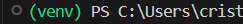

# Como instalar o projeto

Versão do Python utilizada: 3.12.3

Rodar os comendos dentro do diretório do projeto
1. Criação do ambiente virtual Python:
> python3 -m venv .venv

2. Ativar ambiente virtual Python:
> .venv\Scripts\activate  
- para saber se está ativada, verifique se aparece '(.venv)' antes do caminho do dietório no terinar

3. Instalar as bibliotecas:
> pip install -r requirements.txt

4. Criar arquivo .env
* criar um arquivo .env na raiz do projeto
* criar a variável com a credencial do banco de dados "DATABASE_URL=...." 

5. Rodar a aplicação
* no terminal, ainda com a .venv ativada
> Flask run